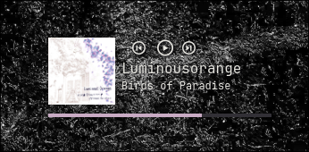

# Linux-Music-Controller-Widget
A small draggable music controller that is on top of all applications. Works for Spotify using playerctl. Made using Aylurs-GTK-Shell.

# Requirements:

Wayland based desktop environment. I use hyprland with arch but probably works elsewhere.

spotify

aylurs-gtk-shell:
Follow the directions in the [wiki](https://aylur.github.io/ags).

playerctl:
`sudo pacman -Sy playerctl`

# Installation:

Clone the directory somewhere in your machine. Make sure that you have ags installed and you have done `ags init`.

Copy the app.tsx, style.css and widgets directory to you ~/.config/ags directory

Run using `ags run`

you can also alias ags to run outside of the terminal by adding this line to your .bashrc file.
`alias music='(ags run > /dev/null 2>&1 &)'`

now you can run it by typing `music` into the terminal
